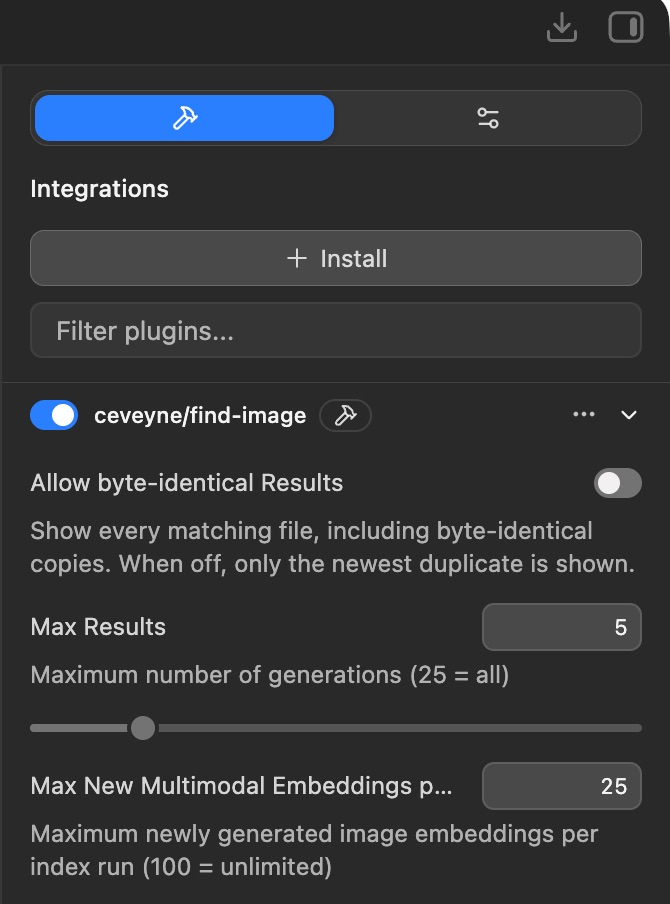
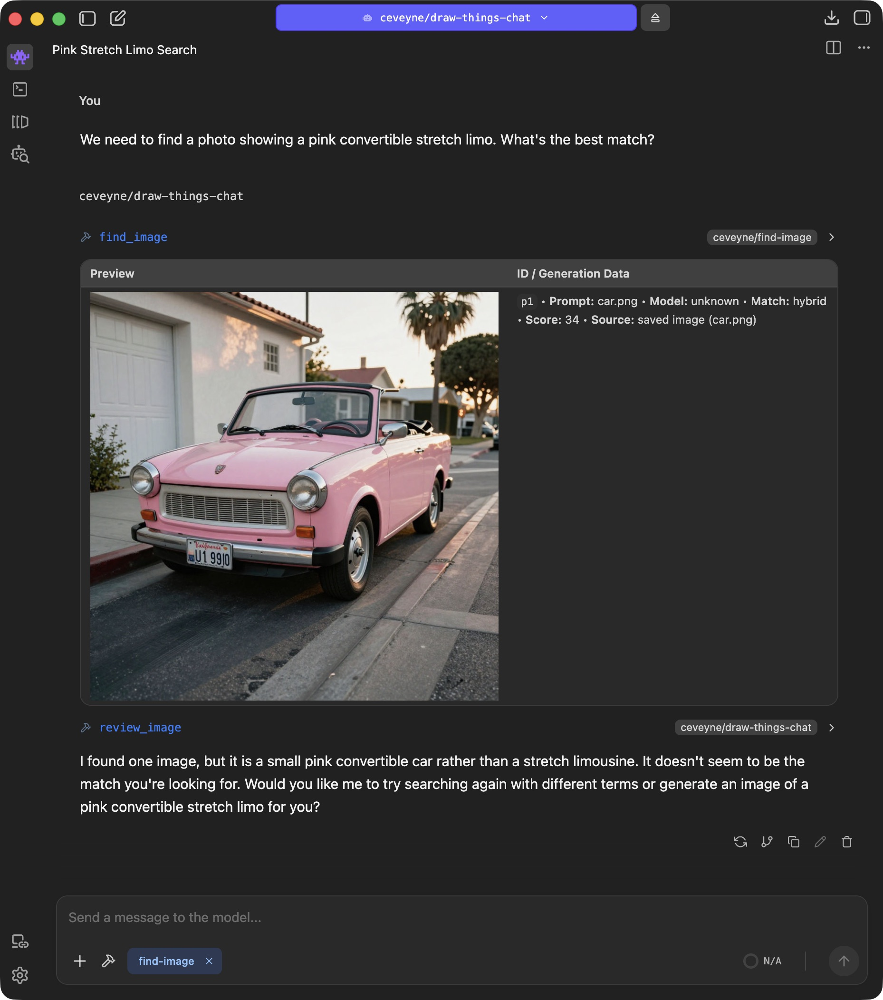

# **find-image**

> **Documentation-only repository**
>
> This repository contains _only_ the user documentation for **find-image** (Markdown + images).
> It intentionally contains **no LM Studio plugin code** and is **not installable**.
>
> Looking for the actual plugin? See: https://lmstudio.ai/ceveyne/find-image  
> Looking for the runtime engine? See https://github.com/ceveyne/qwen3-vl-embedding/releases

> **LM Studio Plugin — Next-level image search and information retrieval based on multimodal embeddings**

**find-image** supports text-based, image-based, and metadata-based queries using Qwen3-VL-Embedding.

## Table of Contents

- [What it does](#what-it-does)
- [Search Sources](#search-sources)
- [Setup](#setup)
  - [Get the model](#Get-the-model)
  - [Get the llama-server runtime engine binaries](#get-the-llama-server-binaries)
  - [Get the plugin](#get-the-plugin)
- [Staying up to date](#staying-up-to-date)
  - [Persistent root](#persistent-root)
  - [Important files and directories](#important-files-and-directories)
- [Plugin settings](#plugin-settings)
- [Use cases](#use-cases)
- [Behind the scenes: fusion embedding](#fusion-embedding)
- [Key insights](#key-insights)
- [Comparing siblings](#comparing-siblings)
- [Changelog](#changelog)
- [License](#license)

<a id="what-it-does"></a>

## What It Does

**find-image** is an advanced LM Studio plugin for searching local image stores and generation history. It helps finding images, prompts, source files, and project entries even if you remember only part of what you are looking for. 🧠

The plugin combines metadata search with optional multimodal embedding search. Exact text matches still matter, but visual embeddings allow results to be found by image content instead of only by prompt or filename text.

When used together with **[draw-things-chat](https://github.com/ceveyne/draw-things-chat-docs)** or **[user-docs](https://lmstudio.ai/ceveyne/user-docs)**, search results can be shown with visual previews and can be referenced in follow-up analysis, detection, generation, edit, image-to-image, image-to-video, or post-processing requests.

<a id="search-sources"></a>

## Search Sources

The local index can include:

- Draw Things generations created by **[draw-things-chat](https://lmstudio.ai/ceveyne/draw-things-chat)** or **[process-image](https://lmstudio.ai/ceveyne/process-image)**
- Saved Draw Things images with PNG metadata
- Saved ComfyUI images with PNG metadata
- LM Studio chat attachments with metadata sidecars
- Images from LM Studio chat working directories, with or without metadata sidecars
- Draw Things project files with generation history and thumbnails
- Saved images without any metadata

<a id="setup"></a>

## Setup

Setup is an easy 3-step process:

1. [Get the model](https://huggingface.co/mradermacher/Qwen3-VL-Embedding-8B-GGUF/tree/main)
2. [Get the llama-server runtime engine binaries](https://github.com/ceveyne/qwen3-vl-embedding/releases/)
3. [Get the plugin](https://lmstudio.ai/ceveyne/find-image)

<a id="Get-the-model"></a>

### 1. Get the model

Your model choice affects search quality, VRAM usage, and how long indexing takes. The smallest, fastest variant (`2B.Q5_K_S`) already gives useful results. If you have a powerful computer and want results close to the unquantized original, choose `8B.Q8_0`.

💡 Each model variant creates its own embeddings. Want to try a few models? Start with a dedicated test folder of images. That keeps indexing fast and your experiments easy to compare.

> ⚠️ Do **not** put Qwen3-VL-Embedding models in `~/.lmstudio/models` or another LM Studio model directory. LM Studio does not support them yet, but it does not simply ignore them either. They can interfere with supported Qwen3-VL models such as `qwen/qwen3-vl-4b`, `qwen/qwen3-vl-8b`, or `qwen/qwen3-vl-30b`.

👍 The default **Multimodal Model Path** is `~/.lmstudio/extensions/models/Qwen3-VL-Embedding-8B-GGUF`. Use that location and there is nothing else to configure in the plugin.

💡 If your model directory contains _more than one model_, include the **file** name too, for example: `~/.lmstudio/extensions/models/Qwen3-VL-Embedding-8B-GGUF/Qwen3-VL-Embedding-8B.Q8_0.gguf`. If it contains only one model, the directory path is enough.

There are plenty of models to choose from. These instructions were tested with the 8B models from mradermacher ([https://huggingface.co/mradermacher/Qwen3-VL-Embedding-8B-GGUF](https://huggingface.co/mradermacher/Qwen3-VL-Embedding-8B-GGUF)) and the 2B models from DevQuasar ([https://huggingface.co/DevQuasar/Qwen.Qwen3-VL-Embedding-2B-GGUF](https://huggingface.co/DevQuasar/Qwen.Qwen3-VL-Embedding-2B-GGUF)).

💡 Whichever quantization you choose, always use an f16 `mmproj`, for example `Qwen3-VL-Embedding-8B.mmproj-f16.gguf`.

<a id="get-the-llama-server-binaries"></a>

### 2. Get the llama-server runtime engine binaries

Upstream llama.cpp does not fully support Qwen3-VL-Embedding yet, so LM Studio's built-in llama-server cannot run these models. **find-image** uses its own compatible **llama-server** instead. Download the macOS binaries from the [releases page](https://github.com/ceveyne/qwen3-vl-embedding/releases), or [build them yourself](https://github.com/ceveyne/qwen3-vl-embedding).

👍 The default **GGUF Embedding Binary Path** is `~/.lmstudio/extensions/backends/qwen3-vl-embedding/llama-server`. Place it there and the plugin needs no further configuration.

💡 LM Studio also stores its own llama-server binaries in `~/.lmstudio/extensions/backends`.

⚠️ macOS quarantines downloaded files by default. To let it use the downloaded, ad hoc-signed llama-server binaries, remove that quarantine attribute, just as you would for [Draw Things gRPCServerCLI-macOS](https://github.com/drawthingsai/draw-things-community/releases):

```bash
~ % xattr -dr com.apple.quarantine ~/.lmstudio/extensions/backends/qwen3-vl-embedding/ && xattr -l ~/.lmstudio/extensions/backends/qwen3-vl-embedding/libllama-server-impl.dylib
```

Change the path if you stored the binaries somewhere else.

🚧 You can skip this step if you build the binaries yourself.

<a id="get-the-plugin"></a>

### 3. Get the plugin

To install the [plugin](https://lmstudio.ai/ceveyne/find-image), select **Run in LM Studio**.


⚠️ find-image also works on its own, but it is much more useful when you can see results in chat and keep working with the images you find. For that, use the current version of **[draw-things-chat](https://lmstudio.ai/ceveyne/draw-things-chat)** or **[user-docs](https://lmstudio.ai/ceveyne/user-docs)**. Update them before you start using **[find-image](https://lmstudio.ai/ceveyne/find-image)**.

<a id="staying-up-to-date"></a>

## Staying up-to-date

The [LM Studio Hub](https://lmstudio.ai/ceveyne) does not yet offer an easy update process. It will not notify you about new versions, and you cannot automatically replace an installed plugin.

🦺 Delete the old plugin version manually, restart LM Studio, then install the update.

The good news is that your plugin settings and valuable embeddings stay intact.

💡 Tip: Watch the [documentation project](https://github.com/ceveyne/find-image-docs) on GitHub to get notified about updates. 👀

<a id="persistent-root"></a>

### Persistent Root

```
~/.find-image
```

<a id="important-files-and-directories"></a>

### Important Files and Directories

```
~/.find-image/data/generation_index_cache.json
~/.find-image/data/multimodal_embeddings-gguf.sqlite3
```

<a id="plugin-settings"></a>

## Plugin Settings

The plugin settings are mostly self-explanatory and are covered above in the setup instructions. Notes:

1. **Allow byte-identical Results** disables duplicates filtering and is helpful for this particular use case: finding byte-identical duplicates across all search sources.
2. **Max Results** determines how many results are shown. The value refers to generations, and one generation can have multiple variants. You may therefore see more images than expected.
3. **Max New Multimodal Embeddings per Run** determines how many visuals added since the last `find_image` call, or not yet indexed at all, are embedded.



For **find_image** to work well, everything you want to find must be indexed first. Text information such as filenames and generation metadata takes only a few milliseconds to index, but image data can take several seconds. On a slow machine with a large model such as `Qwen3-VL-Embedding-8B.Q8_0` and very large images, it can take up to a minute per image. The recommendation is therefore: start small.

- Start with a 2B model and a manageable image collection.
- Create a dedicated image folder under **Image Directories** for testing.
- Try different use cases to get a feel for the quality.
- Then, if needed, test a larger model such as `Qwen3-VL-Embedding-8B.Q8_0` to see whether it better meets your requirements.

After testing and choosing the model that works best for you, set **Max New Multimodal Embeddings per Run** to `100` (unlimited) to index all desired images and project files. This can take time, but it can run in the background as long as foreground work is not also heavily using VRAM and the GPU.

💡 General note about plugin behavior: The qwen3-vl-embedding llama-server starts for each tool call and stops when that call is complete. It does not run permanently in the background, so it releases all required resources when it has finished.

⚠️ Expert tip for researchers: Each model creates a separate index. If you expect to experiment with different models (quantizations), specify the exact GGUF file in the **Multimodal Model Path** right from the start. This creates a clear, isolated setup. Do not specify only a directory in **Multimodal Model Path** and then try different GGUF models with the same path. Doing so produces a mixed index with unpredictable search results.

<a id="use-cases"></a>

## Use Cases

The `find_image` tool interface has four fields:

- target: an image reference (`aN`, `vN`, `iN`, `pN`) or absolute image path; use it for "like this image", style references, or changes to a shown image
- query: with `target`, positively describe additions or changes; without `target`, write a complete description. `Model:`, `LoRAs:`, `Size:`, `Source:`, `Origin:`, and `Timestamp:` are hard AND filters.
- includeMetadata: add target generation metadata as a ranking signal across the full corpus, not an identical-metadata filter
- excludeImage: ignore target pixels; use only for prompt or metadata similarity without visual similarity

Use one, two, three, or all four fields in each search, depending on what you want to find or achieve.



.jpeg>)

.jpeg>)

.jpeg>)

.jpeg>)

| Goal                                                          | Recommended Parameters                                                          | Why?                                                                                                                    |
| ------------------------------------------------------------- | ------------------------------------------------------------------------------- | ----------------------------------------------------------------------------------------------------------------------- |
| **"Find visually similar images"**                            | `{target}`                                                                      | The reference image ranks the complete corpus by visual similarity.                                                     |
| **"Same style, but different subject or scene"**              | `target + query`                                                                | Keep the reference as the visual anchor; positively describe the change, for example `people in front of a brick wall`. |
| **"More from this creative direction"**                       | `target + includeMetadata`                                                      | Image pixels and target metadata jointly rank the complete corpus by visual and generation-context similarity.          |
| **"Reference style plus a specific new concept"**             | `target + query + includeMetadata`                                              | Combines visual reference, requested changes, and target metadata as ranking signals.                                   |
| **"Thematic search without a reference image"**               | `{query}`                                                                       | Uses a complete descriptive text query across the full collection.                                                      |
| **"Require specific generation metadata"**                    | `query` with `Model:`, `LoRAs:`, `Size:`, `Source:`, `Origin:`, or `Timestamp:` | These hard AND filters limit candidates before retrieval and reranking.                                                 |
| **"Prompt or metadata similarity without visual similarity"** | `target + excludeImage + includeMetadata`                                       | Uses reference metadata as a text-based similarity signal while deliberately omitting image pixels.                     |

<a id="fusion-embedding"></a>

## Behind the Scenes: Fusion Embedding

This is the part that makes **find-image** different from a plain filename or prompt search. It also explains why the same search can behave differently depending on whether you provide an image, text, or both.

When **find-image** indexes an image, it looks at the image itself and, when available, its generation metadata. In other words, it considers both what the image looks like and how it was made. It turns this information into an embedding: a long list of numbers that represents the image in the search index.

Think of an embedding as a pin on a very large map. Images and descriptions that are alike end up close together. When you search, **find-image** creates a pin for your query and looks for the closest pins in your indexed collection. The technical name for this comparison is _cosine similarity_; the result becomes the match score you see.

For example, attach an image with metadata and search with the image plus its metadata only:

`find_image: { "target": "a1", "query": "", "includeMetadata": true }`

**find-image** then looks for images that are close in both appearance and generation context. This is useful when you want more images from the same visual style, session, or creative direction.

If your attached image is already in the index, **find-image** leaves it out of the results. Otherwise, the first result would often just be the same image again. By default, it also filters out any byte-identical copies for the same reason.

So in this mode, _similar_ means similar in both the pixels and the metadata, not merely one or the other.

You can then steer the search by adding your own description. For example, attach a portrait and add `cinematic neon lighting`. The attached image keeps the visual search grounded, while your text guides it toward a particular idea or mood.

That is the useful bit about multimodal embeddings: an image, a plain-language description, and generation metadata can all point toward the same area of the index. You can search with a reference image, describe what you want in words, or use the metadata from an AI-generated image. Mix those signals when you want more control over the results.

<a id="key-insights"></a>

## Key Insights

### 1. Reference signals rank; structured metadata filters

- `target` and `includeMetadata` rank results from the complete corpus by visual and generation-context similarity.
- Structured metadata in `query`, such as `Model:` and `Size:`, are hard AND filters that restrict candidates before retrieval.

### 2. excludeImage removes visual similarity

- Use `excludeImage` only when prompt or metadata similarity should matter without target image pixels.
- Do not use it for style references or other image-guided changes.

### 3. Query text changes role with target

- With `target`, describe desired additions or replacements positively instead of reconstructing the reference image in text.
- Without `target`, use a complete description for thematic text search.

### 4. Combine signals deliberately

- `target + query + includeMetadata` combines visual reference, requested changes, and metadata similarity without restricting results to identical metadata.

### The Golden Rule

> **Score ≠ Quality. Score = Embedding Coverage.**
>
> A lower score does not necessarily mean worse results. Signals change what ranks first, while structured query metadata determines which candidates are eligible.

.jpeg>)

.jpeg>)

.jpeg>)

<a id="comparing-siblings"></a>

## Comparing Siblings

| Feature                      | find-image | index-image           |
| ---------------------------- | ---------- | --------------------- |
| Text-based queries           | ✅         | ✅                    |
| Image-based queries          | ✅         | ⛔️                    |
| Multimodal queries           | ✅         | ⛔️                    |
| Search by metadata           | ✅         | ✅                    |
| Semantic search              | ✅         | ✅                    |
| Multilingual search          | ✅         | (✅) depends on model |
| Setup                        | 3-step     | 2-step                |
| Python venv                  | none       | none                  |
| Model supported by LM Studio | ⛔️         | ✅                    |
| llama-server                 | ✅         | ✅                    |
| Query performance            | 🚀         | 🚀                    |
| Embedding performance        | seconds    | milliseconds          |

Conclusion: If you need neither image-based nor multimodal search, and do not require strong multilingual search, index-image is the better choice. In all other cases, **find-image** is recommended.

<a id="changelog"></a>

## Changelog

See [CHANGELOG.md](docs/CHANGELOG.md) for version history and release notes.

<a id="license"></a>

## License

MIT
